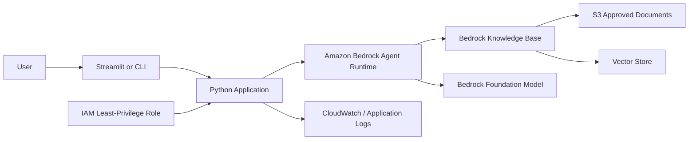
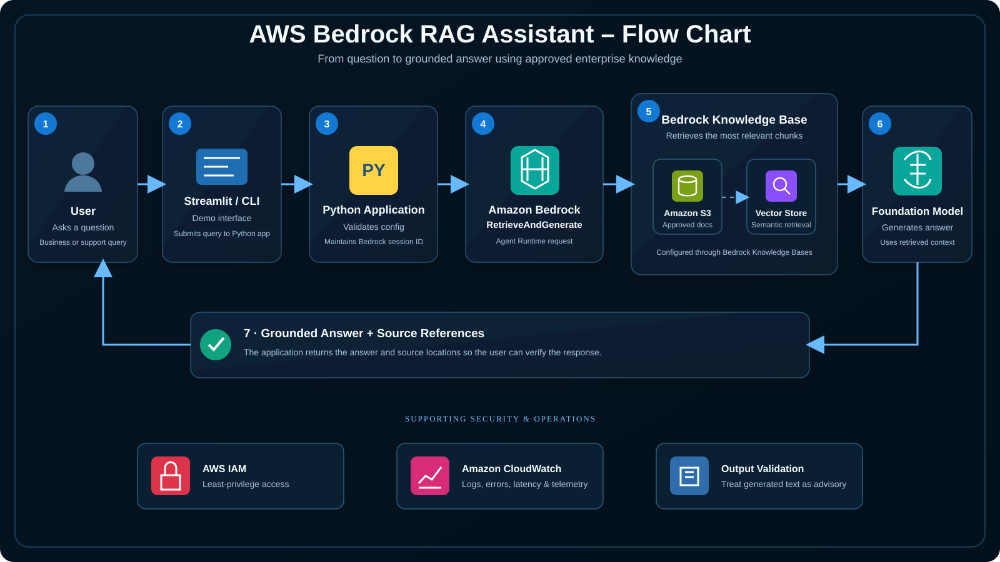
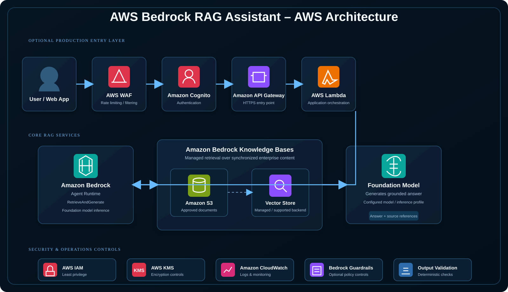

# Amazon Bedrock RAG Assistant

A secure retrieval-augmented generation (RAG) portfolio project built around Amazon Bedrock Knowledge Bases. The application retrieves approved enterprise content, sends the retrieved context to a Bedrock foundation model, returns a grounded answer, and exposes source references for verification.

## Why this project

General-purpose LLM answers are not enough for enterprise support scenarios. This project demonstrates how to ground responses in approved source material while applying cloud-security controls around identity, logging, data access, and configuration.

## Architecture



A production deployment can place the Python application behind API Gateway and Lambda, add Cognito authentication, use KMS encryption, private networking where appropriate, and Bedrock Guardrails depending on the use case.

## Visual architecture

### End-to-end RAG flow



### AWS service symbology view



The first diagram reflects the implemented portfolio flow. The second shows a production-ready reference pattern around that core workflow; WAF, Cognito, API Gateway, Lambda, KMS, and Bedrock Guardrails are optional hardening components rather than claims about the current demo deployment.

## What this project demonstrates

- Amazon Bedrock Knowledge Bases
- Retrieval-augmented generation (RAG)
- Grounding AI responses in approved enterprise content
- Source attribution / citation handling
- Session-aware conversational queries
- Python and boto3 integration with Bedrock Agent Runtime
- IAM least privilege and separation of data/model permissions
- Secure configuration with environment variables rather than embedded credentials
- Enterprise AI security considerations such as prompt injection, data leakage, authorization, logging, and output validation

## Files

- `app.py` - reusable Bedrock RAG client and CLI
- `streamlit_app.py` - simple interview/demo UI
- `requirements.txt` - Python dependencies
- `.env.example` - safe configuration template
- `architecture.md` - AWS architecture and security design
- `iam-policy-example.json` - sample least-privilege application policy template
- `knowledge/company-cloud-security-standard.md` - sample document for knowledge-base ingestion
- `knowledge/incident-response-sop.md` - sample support/incident procedure
- `docs/aws-setup-guide.md` - AWS setup steps
- `docs/interview-demo.md` - interview walkthrough and talking points

## Prerequisites

1. AWS account with Amazon Bedrock model access configured.
2. A Bedrock Knowledge Base created and synchronized with an approved data source.
3. An AWS identity or workload role authorized to call the required Bedrock runtime operation.
4. Python 3.10+.

## Configure

Copy `.env.example` to `.env` and set:

```text
AWS_REGION=us-east-1
BEDROCK_KNOWLEDGE_BASE_ID=YOUR_KB_ID
BEDROCK_MODEL_ARN=YOUR_FOUNDATION_MODEL_OR_INFERENCE_PROFILE_ARN
BEDROCK_NUMBER_OF_RESULTS=5
```

Do not place AWS access keys in source code. Use an AWS profile, IAM Identity Center, EC2/ECS/Lambda role, or another approved AWS credential provider.

## Run the CLI

```bash
pip install -r requirements.txt
python app.py
```

Example question:

```text
What should an engineer verify before granting an application access to production data?
```

## Run the demo UI

```bash
streamlit run streamlit_app.py
```

The UI displays the grounded answer and retrieved source locations returned by Bedrock.

## RAG flow

1. User submits a question.
2. The application sends the query to Amazon Bedrock `RetrieveAndGenerate`.
3. Bedrock retrieves the most relevant chunks from the configured Knowledge Base.
4. The selected foundation model generates an answer grounded in the retrieved content.
5. The application returns the answer and source references.
6. For a production workload, queries, errors, latency, and security events can be monitored without logging unnecessary sensitive prompt content.

## Security design

- Use IAM least privilege for the application execution role.
- Keep approved documents in a controlled S3 bucket with encryption and access logging as appropriate.
- Do not use the LLM as an authorization mechanism; enforce document/data access outside the model.
- Avoid hardcoded credentials and secrets.
- Treat retrieved documents as untrusted input and account for prompt-injection content.
- Validate generated output before it drives a privileged or business-critical action.
- Use application and AWS service logging appropriate to the sensitivity of the workload.
- Consider Bedrock Guardrails for additional policy controls where appropriate.

## Interview walkthrough

> I built a Bedrock RAG assistant because enterprise users need answers grounded in approved company information rather than only model knowledge. The Python application queries a Bedrock Knowledge Base, retrieves relevant document chunks, and uses a Bedrock foundation model to generate a response with source references. I designed the surrounding architecture with IAM least privilege, protected S3 source data, no embedded credentials, logging, and output validation. In production I would add authentication, data-level authorization, encryption, monitoring, and guardrails based on the data sensitivity and business risk.

## Good interview questions this project answers

**Why RAG instead of a normal chatbot?**  
RAG grounds the response in controlled enterprise information and gives the user evidence they can verify.

**Where does AWS fit?**  
Bedrock provides model access and the Knowledge Base retrieval/generation workflow; S3 can hold approved documents; IAM controls access; Lambda/API Gateway/Cognito can provide a serverless application layer; CloudWatch supports operational monitoring.

**How do you secure it?**  
Least-privilege IAM, data authorization, encryption, secret-free source code, controlled ingestion, logging, prompt-injection awareness, output validation, and optional guardrails.

**What would you not let the AI do?**  
I would not allow a generated response alone to authorize access, change production systems, or perform a high-impact action. Those decisions remain enforced by deterministic application controls, IAM, workflow approval, and business rules.
